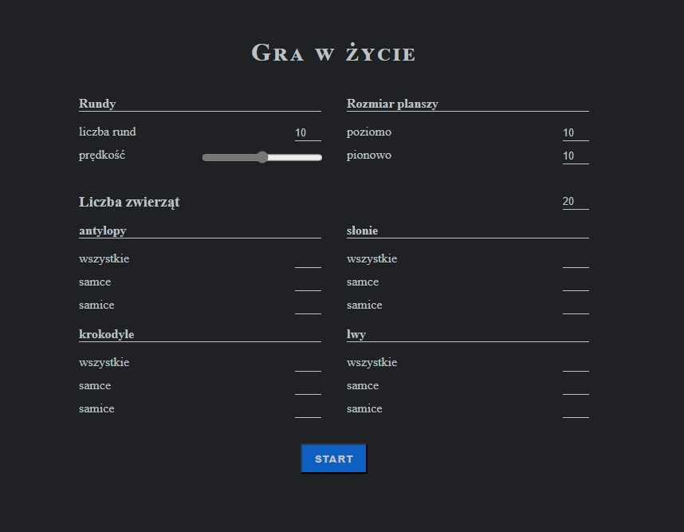
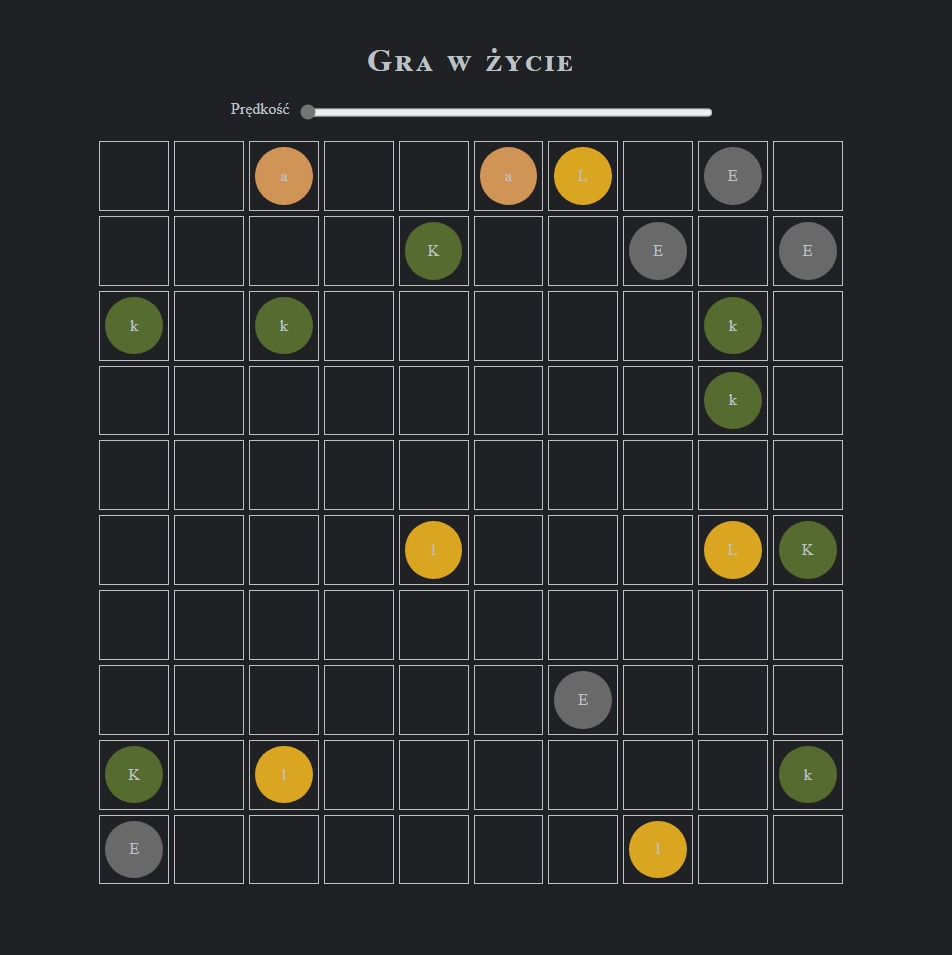

# Gra w życie - projekt treningowy

Zadanie treningowe pochodzące z kursu Programowanie Obiektowe prowadzonego w ramach studiów inżynierskich na kierunku Technologie Informatyczne.

## Spis treści
- [Opis](#opis)
- [Zrzuty ekranu](#zrzuty-ekranu)
- [Założenia dodatkowe](#założenia-dodatkowe)
- [Zastosowane technologie i narzędzia](#zastosowane-technologie-i-narzędzia)
- [Czego potrzebuję, by odpalić kod?](#czego-potrzebuję-by-odpalić-kod)

## Opis

Mimo swojej nazwy jest to bardziej symulacja niż gra. Pierwotnie zadanie miało wykazać umiejętność stosowania przez kursanta prawidłowych technik pisania kodu w języku C# z zachowaniem prawideł programowania obiektowego, w tym stosowania interfejsów, enkapsulacji, dziedziczenia. Stanowiło również podstawę do zaliczenia przedmiotu na ocenę db-bdb.

Niniejszy projekt jest rozwinięciem oryginalnej koncepcji bazującym na czystym Java Script i technologiach webowych.

## Zrzuty ekranu

## Założenia dodatkowe

- Vanila JS
- kod oparty o klasy
- enkapsulacja
- podstawowy interfejs użytkownika
- zobrazowanie graficzne przebiegu symulacji

## Zastosowane technologie i narzędzia

- HTML + CSS + JavaScript
- [Node.js](<https://nodejs.org/>)
- [Parcel](<https://parceljs.org/>)

## Czego potrzebuję, by odpalić kod?

Do uruchomienia kodu niezbędne jest posiadanie zainstalowanego środowiska [node.js](https://nodejs.org/en/) oraz następujące pakiety:

- [Parcel](<https://parceljs.org/>) (bundlowanie paczek i wirtualny serwer)

 

-----------------------------  

**Oryginalna treść zadania**  

 

> # Gra w życie
> 
> Gra w życie (ocena 4-5)
> Wczytaj plansze o zmiennych rozmiarach. Zasymuluj działanie 10 tur. Wyświetl
> planszę po każdej turze. Na planszy mogą występować następujące zwierzęta:
> 1. Lew (L,l) - samiec dużą literą
> 2. Krokodyl (K,k)
> 3. Słoń (S,s)
> 4. Antylopa (A,a)
> Tura polega na wykonaniu następujących czynności:
> 1. Ruch
> 2. Jedzenie 
> 3. Rozmnażanie
> 
> Zwierzęta poruszają się następująco:
> 1. Lew -> w prawo, jeśli nie może to w lewo
> 2. Krokodyl -> w górę, jeśli nie może to w dół
> 3. Słoń -> góra, prawo, dół, lewo (o ile nie może iść w danych kierunku wybiera następny)
> 4. Antylopa -> prawo
> 
> Kolejność wykonywania ruchów przez zwierzęta jest następująca, Najpierw poruszają się te w 1. wierszu (w górnym), potem te w 2. itd. 
> Jeśli jest kilka zwierząt w jednym wierszu to najpierw ruszają się te po lewej (z 1. kolumny), później te po prawej.
> 
> Zwierzęta mogą jeść następująco;
> Krokodyl i Lew mogą zjeść antylopę. Jedzenie odbywa się gdy zwierzę, które można
> zjeść jest na sąsiednim polu (nie poprzez skos).
> 
> Zwierzęta rozmnażają się gdy samiec i samica z jednego gatunku są na sąsiednim polu
> i obok samicy jest wolne pole na którym może pojawić się dziecko losowej płci.
> 
> Przykładowa plansza początkowa:
> 
> Tura 0  
> ..A..
> 
> Tura 1  
> ...A.
> 
> Tura 0  
> ..Aa.
>  
> Tura 1  
> ..A.a
> 
> Tura 2  
> ...Aa
> 
> Tura 0  
> ...A.  
> ...a.
> 
> Tura 1  
> ....A  
> ...Aa